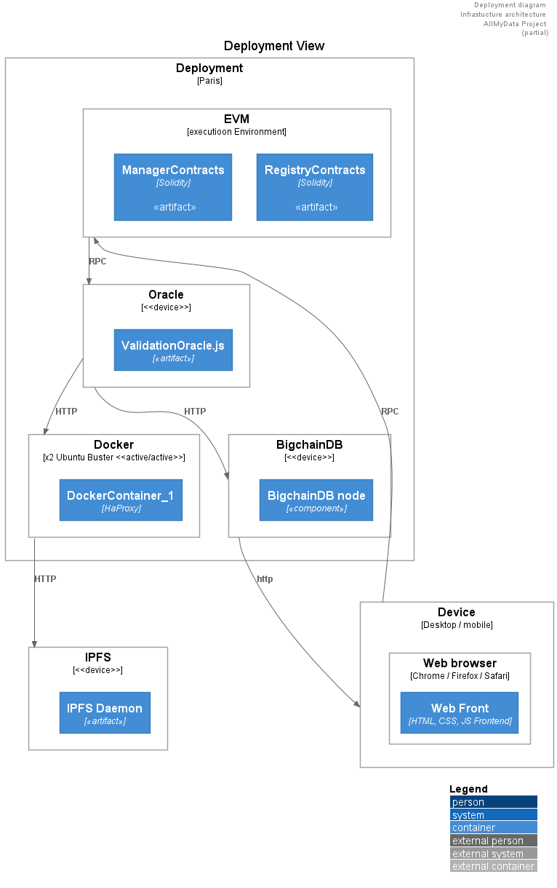

## Deployment View

The deployment view takes into account the system's requirements such as system availability, reliability (fault tolerance), performance (throughput), and scalability. This view maps the various elements identified in the logical, process, and development views—networks, processes, tasks, and objects—onto the processing nodes.
The deployment diagram is used for modeling the static deployment view of a system.
The figure below depicts the deployment diagram for DApp system.

##### Deployment View Diagram

## Network Launch
- With the launch of the mainnet, the HUMAN Network intends to become a permissionless global system allowing people around the world to access or offer labor. At launch, it is expected that HMT holders can spend HMT to schedule jobs on participating HUMAN Exchanges, including participating publishers on hCaptcha. Over the last year, hCaptcha has run at scale on a ‘test’ network, and has already had many requests for this permissionless, self-serve approach. For purposes of comparison of scale, the HUMAN Network executed more tasks and transfers of value on the testnet in 2020 than MakerDAO has executed in the past five years
 
 - a token has been registered, the ownership of the token is transferred to the Auction DApp,
 - The Auction DApp lists each of the registered tokens. 
 
 ## Staking
In blockchain technologies, because there is no central governing authority to oversee what is written into the database, the validity of what is written must be secured in another way. Blockchain technologies use consensus; participating nodes must agree on what is written into the database. 

## Workers 
- The total HMT and current balance of the worker’s wallet address help determine their priority level for tasks served to them from the Exchange Order Book. Higher balances have higher priority as the Exchange selects which job tasks to distribute to which workers.

## Job Requests
 - On the other side of the transaction, Proof of Balance - the amount of HMT the requester holds - is designed to prioritize equal bids from Requesters in the Order Book.
